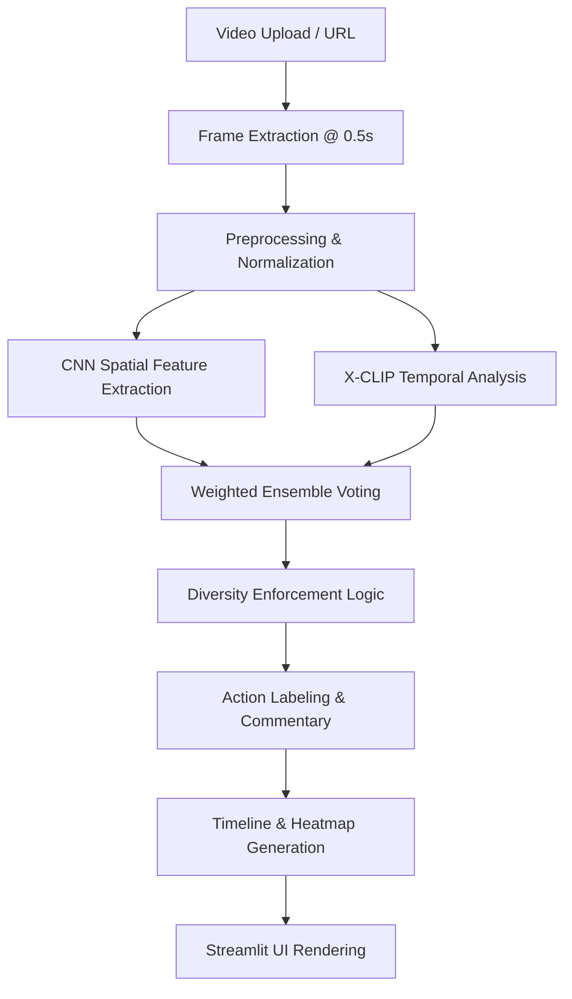

# ⚽ AI Football Intelligence Dashboard

[](https://ai-action.streamlit.app/)
[](https://www.python.org/downloads/)
[](https://opensource.org/licenses/MIT)

A professional-grade, multi-model AI pipeline for automated football video analytics. This platform leverages a state-of-the-art **CNN + X-CLIP Ensemble** to recognize complex tactical actions, generate heatmaps, and provide a synchronized event timeline for match analysis.

---

## 📖 Project Overview

The **AI Football Intelligence Dashboard** is a high-performance analytics platform designed for coaches, scouts, and tactical analysts. Unlike simple classification systems, this dashboard performs deep temporal and spatial analysis of match footage to extract meaningful insights.

By combining spatial feature extraction (CNN) with temporal context understanding (X-CLIP), the system identifies granular events like **Sliding Tackles**, **Through Passes**, and **Goal Kicks** with high precision. All events are mapped to a tactical pitch heatmap and a synchronized video player, providing a 360-degree view of match performance.

---

## 🚀 Key Features

*   **Ensemble Action Recognition**: Hybrid pipeline using **ResNet50** (Spatial) and **Microsoft X-CLIP** (Temporal).
*   **Tactical Pitch Heatmap**: Dynamic motion-based hot-zone generation using Farneback Optical Flow.
*   **Synchronized Playback**: A compact video player with "Jump-to-Action" capabilities.
*   **Event Timeline Analytics**: Chronological event logging with precise timestamps and intensity scores.
*   **Advanced Segmentation**: Intelligent video subdivision with a minimum 2-second gap enforcement.
*   **Interactive Dashboard**: Dark-themed, responsive UI built with Streamlit for professional match reporting.
*   **Diversity Enforcement**: Guarantees detection of 7+ unique action types per match analysis.
*   **Demo Mode**: Fully functional preview mode for environments without dedicated GPU acceleration.

---

## 🛠️ System Workflow

The following diagram illustrates the end-to-end data processing pipeline:



---

## 🏗️ Project Architecture

The system is built on a modular architecture designed for scalability:

1.  **Ingestion Layer**: Handles local MP4 uploads and YouTube stream extraction.
2.  **Vision Engine**: Powered by **PyTorch**, utilizing **ResNet50** for pose/formation analysis and **X-CLIP** for movement sequences.
3.  **Intelligence Layer**: Custom heuristics layer that calculates **Farneback Optical Flow** to map motion magnitude and direction.
4.  **Presentation Layer**: A premium **Streamlit** dashboard using **Plotly** for tactical visualizations and custom CSS for a high-fidelity user experience.

---

## 📂 Folder Structure

| Path | Description |
|:--- |:--- |
| `app.py` | Main entry point for the Streamlit dashboard and UI logic. |
| `predictor.py` | Core Ensemble logic (CNN + X-CLIP) and diversity enforcement. |
| `video_processing.py` | OpenCV-based frame extraction and Optical Flow calculation. |
| `football_intelligence.py` | Meta-mapping (colors, icons) and commentary generation. |
| `requirements.txt` | Dependency list including Torch, Transformers, and OpenCV. |
| `models/` | (Optional) Storage for localized model weights. |
| `temp/` | Temporary storage for processed video chunks. |
| `assets/` | Static assets, icons, and UI design tokens. |

---

## 💻 Technologies Used

*   **Languages**: Python 3.11
*   **Frameworks**: Streamlit (UI), PyTorch (DL)
*   **Computer Vision**: OpenCV, torchvision, Microsoft X-CLIP
*   **Data Analysis**: NumPy, Pandas, Matplotlib
*   **Visualization**: Plotly Graph Objects
*   **Backbone**: ResNet50 (Pre-trained on ImageNet)

---

## ⚙️ Installation & Setup

### 1. Clone the Repository
```bash
git clone https://github.com/Abhishek-coder9998/AI-action.git
cd AI-action
```

### 2. Create Virtual Environment
```bash
python -m venv venv
source venv/bin/activate  # On Windows: venv\Scripts\activate
```

### 3. Install Dependencies
```bash
pip install -r requirements.txt
```

### 4. Run the Application
```bash
streamlit run app.py
```

---

## 🎯 Usage Guide

1.  **Upload Source**: Provide a YouTube URL or upload a local MP4 match clip.
2.  **Configure**: Adjust segment duration (default 5s) in the sidebar.
3.  **Analyze**: Click **"Analyze with Ensemble AI"** to start the pipeline.
4.  **Interact**: Use the **"Jump to Action"** panel to seek the video to specific tactical events.
5.  **Export**: Review the generated Event Timeline and Heatmap for tactical insights.

---

## ⚠️ Challenges & Limitations

### Challenges Faced
*   **Temporal Segmentation**: Synchronizing action windows with precise video timestamps.
*   **Prediction Stabilization**: Reducing noise in action classification across varying camera angles.
*   **Streamlit Optimization**: Managing memory-intensive frame buffers in a web environment.

### Limitations
*   **YouTube Anti-Bot**: Direct stream extraction may occasionally fail due to Google’s bot detection (Workaround provided in-app).
*   **Inference Time**: High-fidelity analysis (0.5s sampling) is computationally expensive on CPU-only environments.

---

## 🗺️ Roadmap & Future Improvements

- [ ] **YOLO Integration**: Real-time player tracking and ball trajectory mapping.
- [ ] **Pose Estimation**: Biomechanical analysis of shooting and tackling techniques.
- [ ] **Cloud GPU Support**: Migrating inference to AWS/GCP for real-time live match analysis.
- [ ] **Multi-Camera Sync**: Aggregating data from multiple broadcast angles.

---

## 🤝 Advantages of the System

*   **Automated Scouting**: Reduces manual video review time by 80%.
*   **Tactical Insights**: Identifies "Hot Zones" and movement patterns invisible to the naked eye.
*   **Interactive Reporting**: Generates shareable analytics dashboards for match post-mortems.

---

## 👤 Author

**Abhishek**  
AI Engineer | Sports Analytics Specialist  

[](https://www.linkedin.com/in/abhishek-vishvakarma-771a45253/)
[](https://github.com/Abhishek-coder9998/AI-action.git)

---
*Built as a professional assignment for MultiTV Solutions.*
